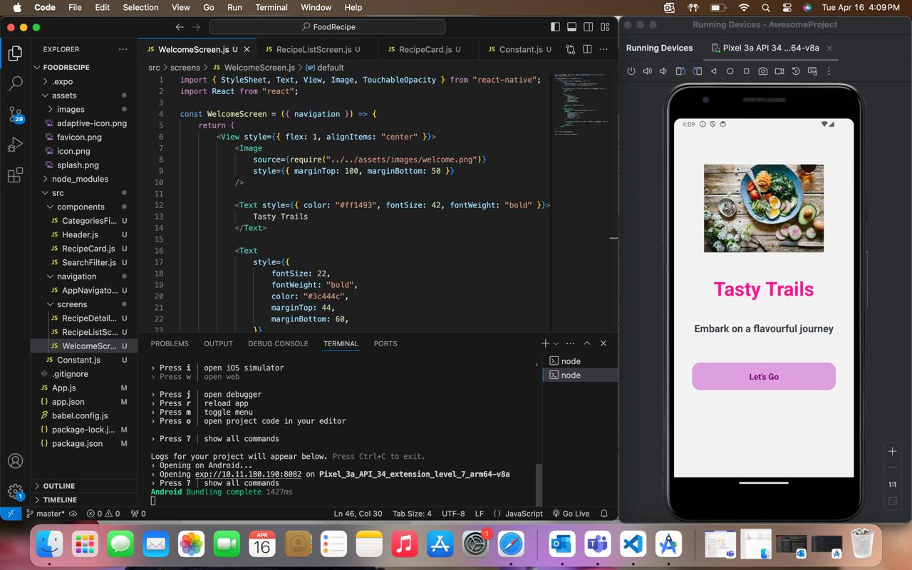
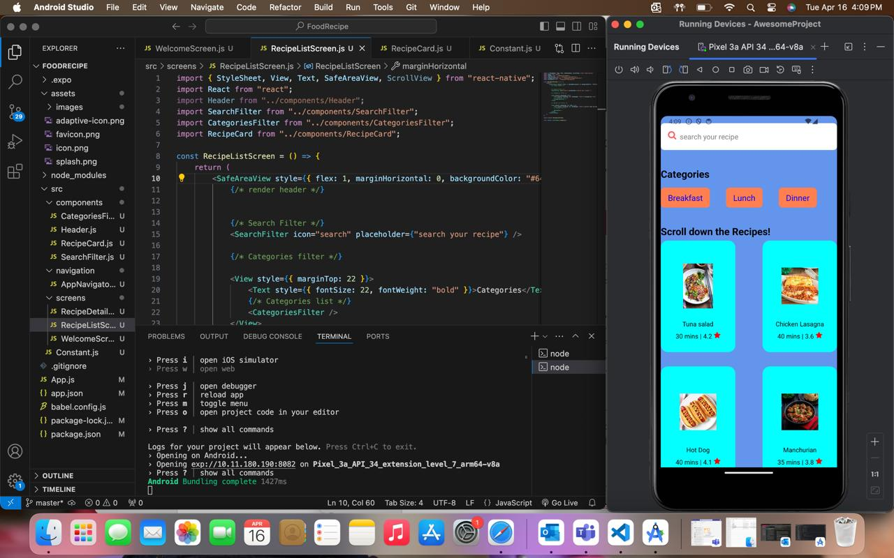
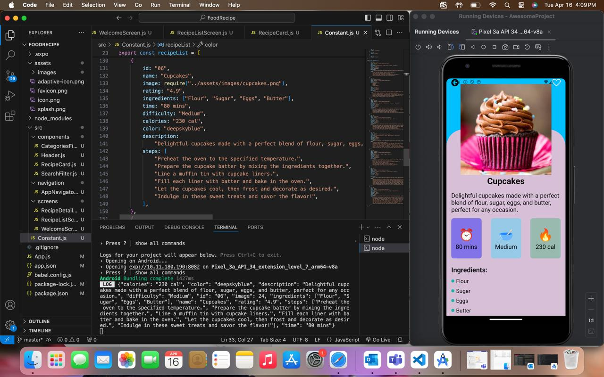

# TastyTrails

## Description

### Explanation of the code

**Navigation**
The `AppNavigator.js` is the default navigator for the project, This creates a Navigation Container which includes all the screens related to our project.

**Welcome Screen**
The is the first screen the user will be presented with. It includes a picture along with the App's name with a small quote. At the bottom we have a button which takes us to the main screen aka Recipe List Screen.

**Recipe List Screen**
The Recipe List Screen includes a Searchbar and a Categories bar on top of the RecipeCard Screen.

**Recipe Detail Screen**
The Recipe Detail Screen, is the part of the screen where the user is directed to when he presses a particular recipe list card. It includes the recipe name, recipe image, description and some extra details like time, difficulty, ingredients and steps.

**Constant.js**
Constant.js the the file which contains the data for the app, it includes the various recipes and all the details of each recipe. Along with this, there are also the various categories that are present.

**RecipeCard**
Recipe Card, is the small cards that appear in the Recipe List Screen. These cards include a Pressable which directs to the particular recipe Detail Screen, We have a small image depicting the dish along with its name.

**Search**
The Search Bar is created to make searching for recipes much easier, it includes a small text as a placeholder. 

**Categories**
The Categories Filter is a horizontal scrollable bar which includes various categories which the user can help filter recipes.

## Presentation

#### Below is the video to our presentation.

https://github.com/SaiAlapati00/TastyTrails/assets/156277633/9a8ab200-5859-41f5-b8e2-6794c4d7b187

## Codes

### Below are the links to various codes

[AppNavigator.js](/src/navigation/AppNavigator.js)

[WelcomeScreen.js](/src/screens/WelcomeScreen.js)

[RecipeListScreen.js](/src/screens/RecipeListScreen.js)

[RecipeDetailsScreen.js](/src/screens/RecipeDetailsScreen.js)

[RecipeCard.js](/src/components/RecipeCard.js)

[SearchFilter.js](/src/components/SearchFilter.js)

[CategoriesFilter.js](/src/components/CategoriesFilter.js)
